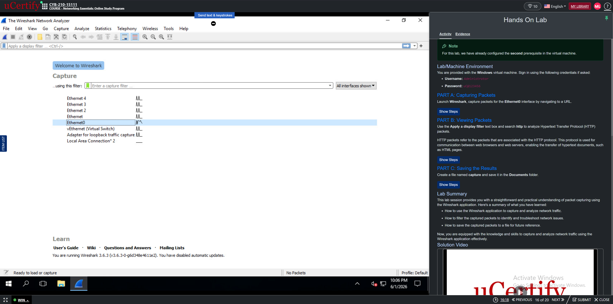
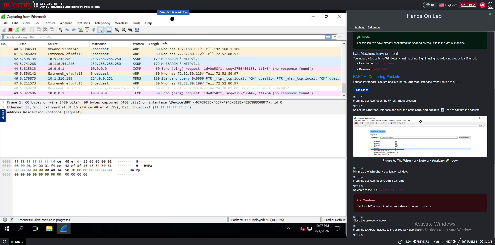
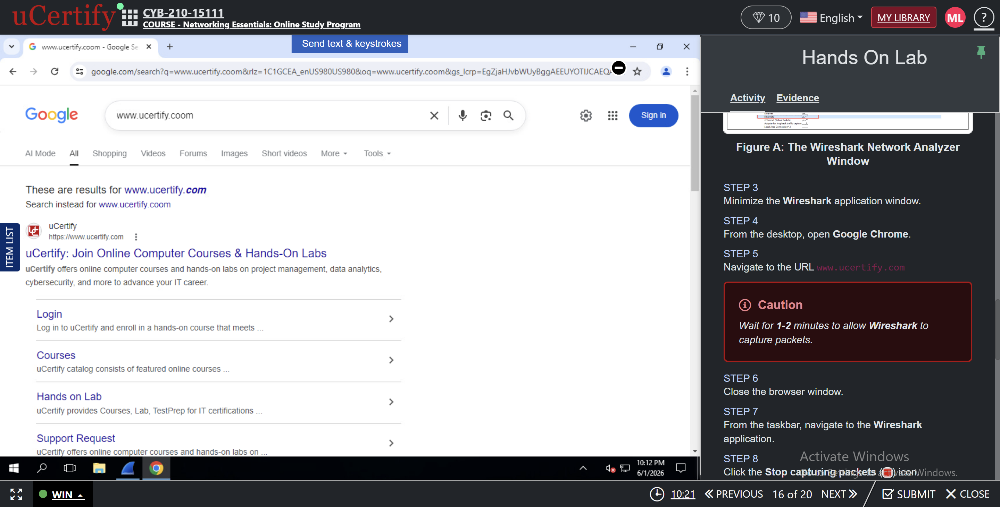
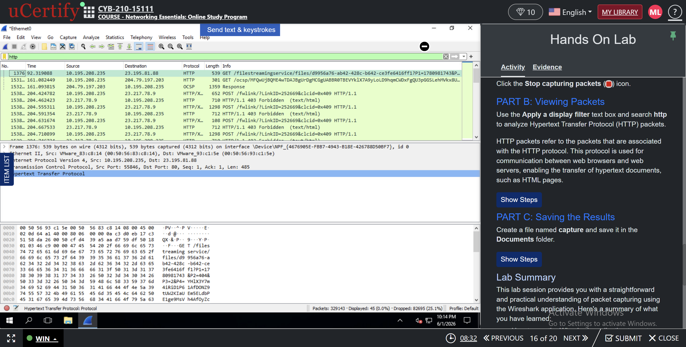
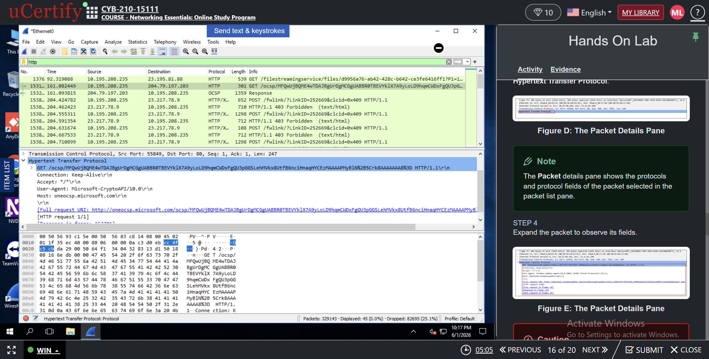
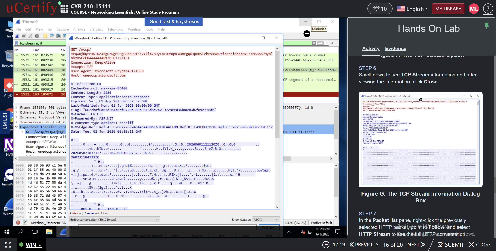
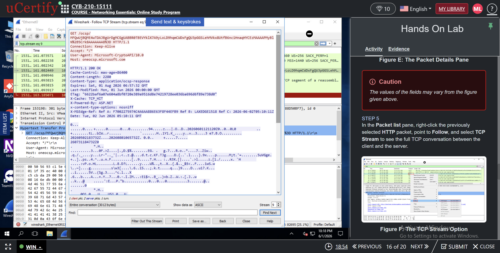
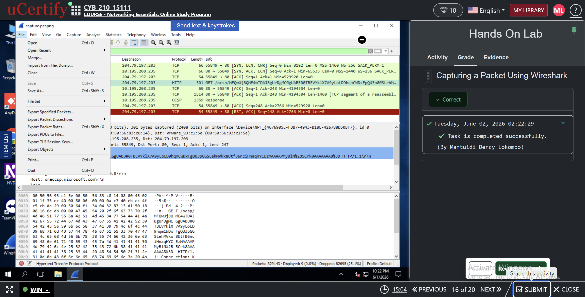

# Wireshark Traffic Analysis Lab

## Project Overview

This project demonstrates how to capture and analyze network traffic using Wireshark.

## Objective

Capture packets generated by web browsing activity and analyze HTTP communications.

## Environment

- Windows 11
- Wireshark
- Google Chrome

## Tasks Performed

1. Started Wireshark packet capture.
2. Selected Ethernet0 interface.
3. Generated traffic by visiting uCertify.
4. Captured network packets.
5. Applied HTTP filters.
6. Examined packet details.
7. Followed the HTTP stream.
8. Saved the capture file.

## Skills Demonstrated

- Packet Capture
- Network Analysis
- HTTP Traffic Inspection
- TCP Stream Analysis
- Wireshark Filtering
- Troubleshooting Network Traffic

 ## Screenshots

### Launching Wireshark

### Packet Capture Running

### Generating Traffic

### HTTP Filter Applied

### Packet Details

### Follow HTTP Stream

### Follow TCP Stream

### Lab Completed

## Key Takeaways

This lab improved my understanding of packet capture, protocol analysis, and network troubleshooting using Wireshark.

## Author
Mantuidi Dercy Lokombo
Cybersecurity Student at Southern New Hampshire University

Dercy Mantuidi  
Cybersecurity Student – Southern New Hampshire University
